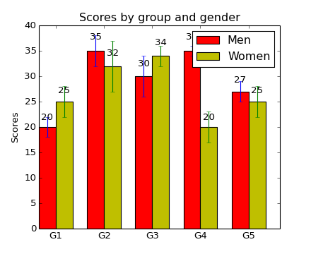

title: Python for Social Scientists
author:
  name: Renee Chu
  twitter: "@reneighbor"
output: slides.html
controls: true

--

### Prereqs:

* python
* matplotlib
* numpy
* Sublime editor

--
# Python for Social Scientists

## Tutorial, PyCon 2014 Montreal

--
### Survey of programming levels in the audience

--
### Smart non-programmers who want to code

Lazy Sunday reading the New York Times

--
### Advice given to new programmers: 

Pick a project you're passionate about

--
### Your project can be answering question X with data

##  Girls-to-boys in primary and secondary school
* United States
* El Salvador
* Pakistan

How do they compare?

--
### Your project can be answering question X with data

## Girls-to-boys in primary and secondary school

### Sidenote: Saudi Arabia

## Girls-to-boys in primary and secondary school

--
### Hacking on data is:

* Interesting
* Widely available
* Easier setup than web

--
### Smart non-programmers who *do* code

Lazy Sunday hacking on data

--
### Today:

1. Aquire our data
1. Manipulate it with python
1. Create interesting visualizations

--
# 1. Acquire our data

--
### World Bank Indicators

* Search "World Bank Indicators"

* data.worldbank.org/indicator

* Export as CSV, Open in Excel

--
### World Bank Indicators

* What is one thing you can see from the data?
* Delete non-column rows on the top, save to Desktop
* Save it as "cellphones.csv"

--
# 2. Manipulate it with Python

--
### Follow these steps:
* Make a new folder "python-for-social-scientists"
* Make a new file inside called "read_data.py"
* In the file type:

	
	print "Hello World"

--
### Find your new file in your terminal

* Where is your folder saved?
* Open up terminal:

	cd Projects/personal-projects/programming-for-social-scientists
	python read_data.py

* You should see "Hello World" spit back at you

--
### Follow these steps:

[Erase the print statement]

	import csv

* libraries are imported

--
### Follow these steps:

	import csv

	csvfile = open('cellphones.csv', 'rU')

* open() is a function

--
### Follow these steps:

	import csv

	csvfile = open('cellphones.csv', 'rU')
	reader = csv.DictReader(csvfile)

* DictReader lets you treat the csv file like a dictionary

--
### This is a Python dictionary

	{
		'Country Code': 'FIN', 
		'Country Name': 'Finland', 
		'2007': '114.924474', 
		'2008': '128.4719884',
		'2009': '144.1530224'
	}

--
### Follow these steps:

	import csv

	csvfile = open('cellphones', 'rU')
	reader = csv.DictReader(csvfile)

	for row in reader:
		print row

--
### Follow these steps:

Run it! In your terminal:

	cd Projects/personal-projects/programming-for-social-scientists
	python read_data.py

--
### Follow these steps:

	import csv

	csvfile = open('cellphones', 'rU')
	reader = csv.DictReader(csvfile)

	for row in reader:
		if row['Country Name'] == "Finland":
			print row

--
### Follow these steps:

--
### Any questions?

--
### What are some things we observe about the output?

--
### What are some things we observe about the output?
* Not sorted
* Data in strings
* Every row

--
## 30 min break

--
# 3. Create interesting visualizations

--
### Find something to copy

http://matplotlib.org/gallery.html

-- 
### MatPlotLib Bar chart demo

http://matplotlib.org/examples/api/barchart_demo.html

-- 
### Examine the code-- What do we know?

-- 
### Examine the code-- What do we know?

http://matplotlib.org/examples/api/barchart_demo.html
* First half is drawing the rects, second is labels
* Values the list
* ax.bar(), 

--
### MatPlotLib Bar chart simplified

* Open the Dropbox public folder
* Make a new file, basic_chart.py
* copy the contents of basic_chart.py

-- 
### In your terminal:

	python basic_chart.py

-- 
### In your text editor:

# How do we get the other countries data?
* Uncomment the lines